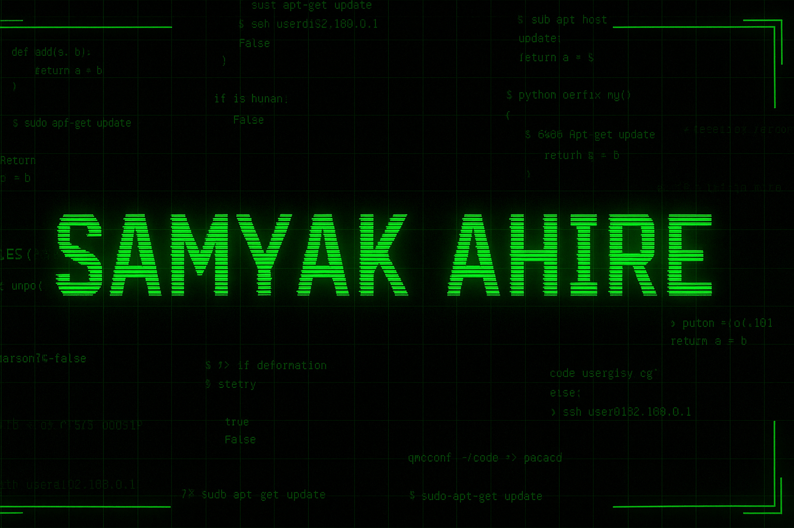

  

  

  <svg width="80%" height="8">
    <rect width="100%" height="3" y="2.5" rx="3" fill="#00FF41" opacity="0.85"/>
  </svg>

## 🟩 About Me
I’m a curious mind, a problem solver, and someone who loves building systems that work quietly in the background but create real impact.  
I believe technology shouldn’t just exist it should **do something meaningful**, something that fixes problems before you even notice they’re there.

I enjoy working where logic meets creativity where one well-written line of code can save someone ten unnecessary steps.  
I build systems that detect the undetectable, automate the unnoticeable, and simplify the overwhelming.

### What sets me apart?
- I don’t chase trends **I chase outcomes**  
- I treat code like storytelling: **clean, structured, intentional**  
- I break things on purpose, fix them under pressure, and learn every time  
- I believe clarity is underrated and simplicity is powerful  

If you're curious about what I do — **scroll down**.  
Or better yet, let’s talk over a cup of chai ☕ and some clean code.

  <svg width="80%" height="8">
    <rect width="100%" height="3" y="2.5" rx="3" fill="#00B331" opacity="0.7"/>
  </svg>

---

## 🟩 Tech Stack
### Languages

### ML / DevOps / Cloud

### Tools & Databases

---

## 🟩 Featured Projects

<b>🔹 ERP Backend System — Role-Based Secure Architecture</b>

 
A structured backend system with multi-role authentication (Teacher / Admin / Super Admin) powered by PostgreSQL and a secure API architecture.

  

<b>🔹 Pothole Detection System — Computer Vision + Automation</b>

 
A CV-based pipeline that detects potholes from video frames and estimates repair costs, enabling automation in road safety analysis.

  

<b>🔹 Dynamic Certificate Generator — Auto PDF Engine</b>

 
A dynamic certificate automation system that generates student certificates directly from database records with customizable templates.

  

<b>🔹 Mahaparivahan Web Scraper — Structured Data Automation</b>

 
A scraper that collects, cleans, and structures transport-related data using safe request handling and retry-backed automation logic.

  

  <svg width="80%" height="8">
    <rect width="100%" height="3" y="2.5" rx="3" fill="#8A2BE2" opacity="0.85"/>
  </svg>

---

## 🟩 What I'm Building
- Intelligent automation pipelines  
- Cloud-native architectures  
- ML-backed decision systems  
- DevOps tooling (CI/CD, monitoring, Docker)  

---

## 🟩 Currently Exploring
- GenAI + multimodal intelligence  
- Kubernetes scaling strategies  
- Observability with Grafana + Prometheus  
- Scalable backend design patterns  

  <svg width="80%" height="32">
    <rect width="100%" height="32" rx="6" fill="#021007"/>
    <text x="20" y="22" fill="#00FF41" font-family="Share Tech Mono" font-size="16">CONNECT</text>
  </svg>

  

  

  

